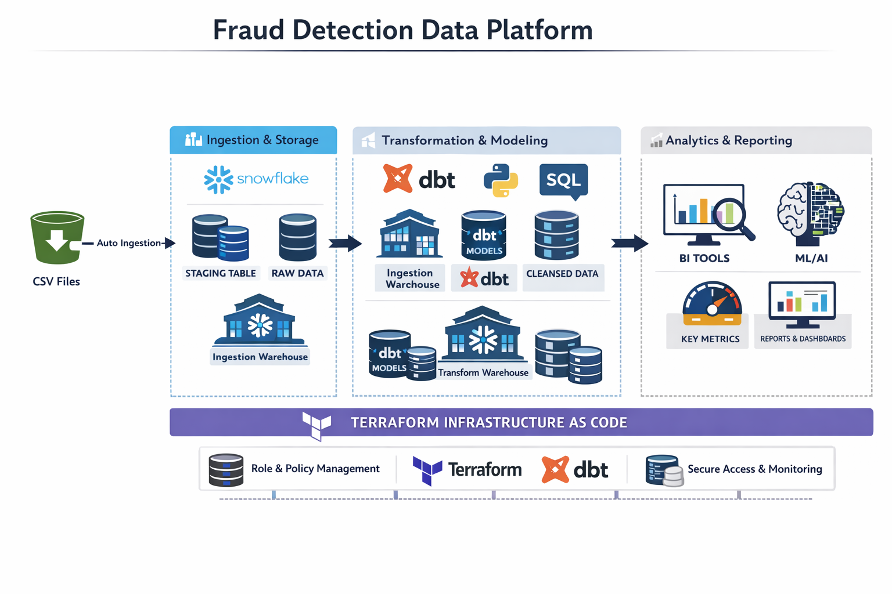
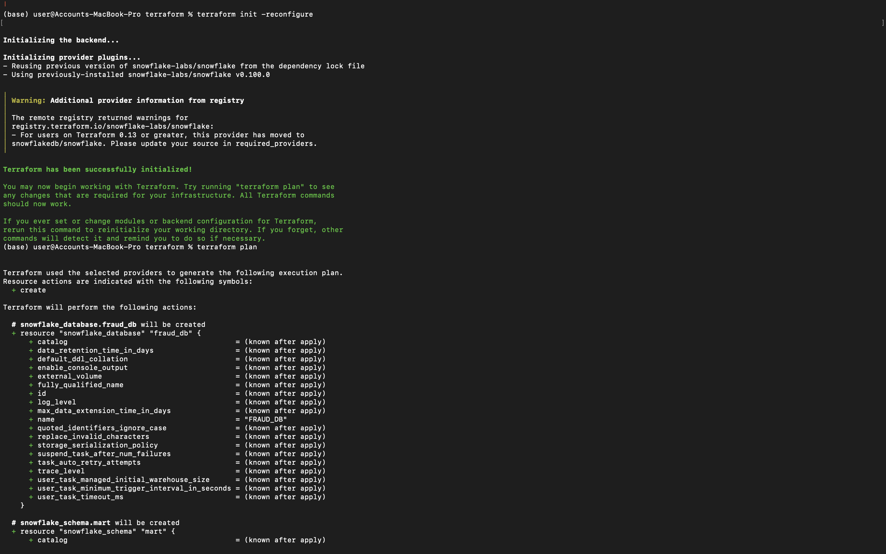
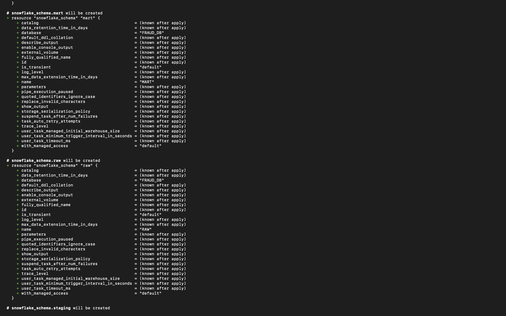
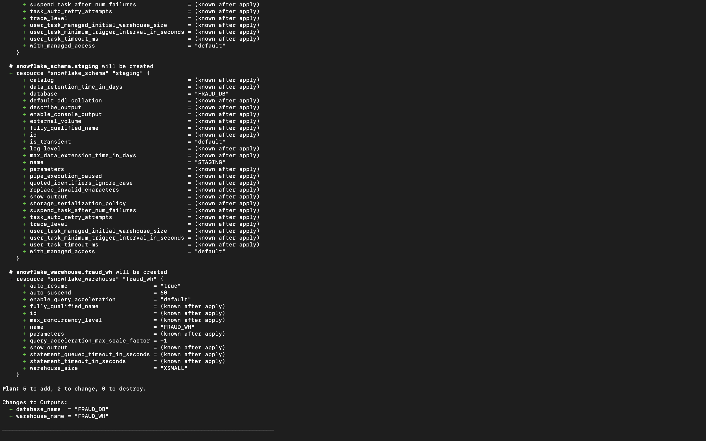

# Bank Transaction Fraud Detection Platform
*A Production-Grade Cloud Data Engineering & ML Pipeline for Fraud Analytics*

This project implements a **Fraud Detection Data Platform** using **Snowflake**, **Terraform**, **dbt**, and **Python**. The platform ingests bank transaction data, transforms it, performs feature engineering, applies rule-based fraud scoring and machine learning models (Random Forest & Isolation Forest), and delivers analytics-ready tables and dashboards.  

The pipeline leverages **Snowpipe** for ingestion, **Terraform** for infrastructure provisioning, **dbt** for transformations, and **Python/ML scripts** for modeling and anomaly detection.

---

##  Architecture Overview

### **Architecture**

     ┌───────────────────────────┐
     │  Raw Transaction Data      │
     │  (CSV / Bank APIs)        │
     └─────────────┬─────────────┘
                   │
                   ▼
     ┌───────────────────────────┐
     │ Snowflake Staging Tables   │
     │  Raw ingestion via Snowpipe│
     └─────────────┬─────────────┘
                   │
                   ▼
     ┌───────────────────────────┐
     │ dbt Transformations       │
     │  - Staging               │
     │  - Feature Engineering   │
     │  - Fraud Scoring         │
     └─────────────┬─────────────┘
                   │
                   ▼
     ┌───────────────────────────┐
     │ Analytical Tables / Marts │
     │  Ready for ML & Dashboards│
     └─────────────┬─────────────┘
                   │
                   ▼
     ┌───────────────────────────┐
     │ ML Models                  │
     │  - Random Forest Classifier│
     │  - Isolation Forest        │
     └─────────────┬─────────────┘
                   │
                   ▼
     ┌───────────────────────────┐
     │ Dashboards & Reports      │
     │  Fraud Analytics / BI     │
     └───────────────────────────┘
                   │
                   ▼
     ┌───────────────────────────┐
     │ Terraform IaC             │
     │  Snowflake DB/Warehouse   │
     │  Roles/Grants             │
     └───────────────────────────┘

---

##  Key Features

###  Rule-Based Fraud Scoring
- Detects suspicious transactions using multiple rules:
  - High transaction amounts (top 2%)
  - Amount exceeds account balance
  - Multiple login attempts
  - Rapid-fire transactions
  - Night-time or weekend activity
- Combines scores into a **FraudLabel** for supervised ML.

###  Feature Engineering
- `TransactionCountPerAccount` – Frequency of transactions per account
- `AmountOverBalance` – Ratio of transaction amount to account balance
- `DaysSinceLastTransaction` – Detect unusual timing patterns
- Encodes categorical variables and scales numeric features for ML

###  Machine Learning
- Random Forest Classifier for supervised fraud detection
- Isolation Forest for unsupervised anomaly detection
- Metrics & Visualizations:
  - Confusion matrix
  - ROC curve
  - Feature importance

###  Automated Ingestion & Transformation
- **Snowpipe** for continuous ingestion into staging tables
- **dbt** for transformations, feature engineering, and building marts
- Terraform provisions Snowflake objects, roles, and grants

---

##  Tech Stack

| Layer | Technology | Purpose |
|-------|------------|---------|
| **Cloud Warehouse** | Snowflake | Data storage, processing, transformation |
| **IaC / Provisioning** | Terraform | Snowflake DB, roles, warehouses, grants |
| **Transformations** | dbt | Staging, feature engineering, marts |
| **ML & Analysis** | Python | Fraud modeling, anomaly detection |
| **SQL** | Snowflake SQL | Querying, transformations, scoring |
| **Ingestion** | Snowpipe | Automated transaction ingestion |
| **Visualization** | BI Tools (Tableau, Power BI) | Dashboards & analytics |

---

##  Output Tables

### **1️⃣ staging.transactions_raw**
- Raw transactions ingested via Snowpipe
- Schema: TransactionID, AccountID, TransactionAmount, TransactionDate, TransactionType, Location, DeviceID, IP Address, MerchantID, Channel, CustomerAge, CustomerOccupation, TransactionDuration, LoginAttempts, AccountBalance, PreviousTransactionDate

### **2️⃣ marts.transactions_features**
- Engineered features ready for ML:
  - TransactionCountPerAccount
  - AmountOverBalance
  - DaysSinceLastTransaction

### **3️⃣ marts.transactions_fraud**
- Fraud scoring output table
- Columns: TransactionID, AccountID, FraudScore, FraudLabel

---

##  Workflow Summary

1. **Ingestion:** Raw transaction CSV/API → Snowflake staging via Snowpipe  
2. **Transformation:** dbt performs staging, feature engineering, and rule-based fraud scoring  
3. **ML Modeling:** Python scripts train Random Forest, run Isolation Forest, and store predictions  
4. **Analytics:** Feature importance, confusion matrix, ROC curve visualizations  
5. **Dashboards:** Fraud reports and anomaly analytics for BI  

---

##  Project Screenshots 

### **1. Terraform Commands**
- `terraform init`  
  
- `terraform plan`  

 

---

This setup provides a **full end-to-end cloud data engineering and ML pipeline** for fraud detection, ready for production deployment with automated ingestion, feature engineering, scoring, and analytics.
